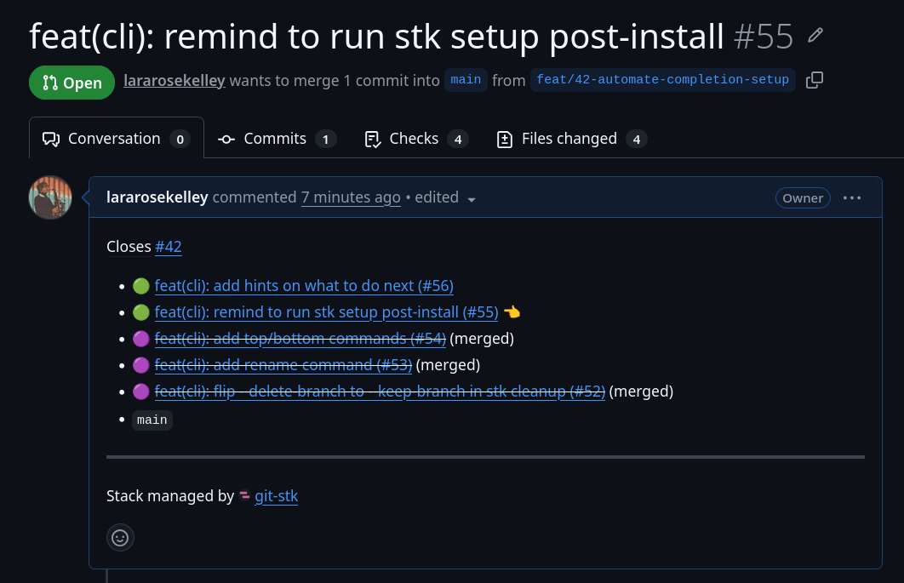

# git-stk

[](https://crates.io/crates/git-stk)

> Git-native stacked branch workflow helper with GitHub and GitLab review integration.

---

`git-stk` keeps stacks as ordinary Git branches. Stack parent metadata is stored locally in `.git/config` as
`branch.<name>.stkParent`, and GitHub PR bases or GitLab MR target branches can be used to reconstruct that metadata.



## Reporting issues

Planned work and known issues are tracked in
[GitHub issues](https://github.com/lararosekelley/git-stk/issues).

Feel free to report bugs, feedback, feature requests, or ask questions
there; just be polite 😉

## Install

```sh
curl https://larakelley.com/sh/git-stk | bash
```

Or with [Homebrew](https://brew.sh):

```sh
brew install lararosekelley/tap/git-stk
```

Installers are also attached to [GitHub Releases](https://github.com/lararosekelley/git-stk/releases). With a
Rust toolchain, `cargo install git-stk --locked` builds from source, or `cargo binstall git-stk` fetches
the prebuilt binary without compiling. The Linux builds are static (musl), so they run anywhere - glibc,
Alpine, or an older distro.

Then install the man page and wire up shell completions (idempotent; prompts before touching your shell rc):

```sh
git stk setup
```

New to stacking? `git stk guide` offers short interactive tours in a disposable sandbox repository:
`intro` (the whole loop - create a stack, submit, restack, land it), `conflicts` (resolve and continue an
interrupted restack), and `repair` (rebuild lost stack metadata). A built-in demo provider stands in for
GitHub, so nothing real is touched and no network is needed; `git config stk.provider demo` works in any
scratch repo for the same offline playground.

Upgrade an installer-managed copy with:

```sh
git stk upgrade
```

## Shell Completions

`git stk setup` configures these automatically. Completions are dynamic: the shell asks the binary for
candidates at completion time, so subcommands, flags, and even branch names complete (`git stk up <TAB>`
offers only the current branch's stack children). The installed binary prints its own registration script,
so completions stay in sync across upgrades:

```sh
# bash: add to ~/.bashrc (the guard keeps shell startup quiet if git-stk is removed)
command -v git-stk >/dev/null && source <(git stk completions bash)

# zsh: write to a directory on your fpath
git stk completions zsh > "${fpath[1]}/_git-stk"
```

```powershell
# PowerShell: add to $PROFILE (git stk setup does this for you on Windows)
if (Get-Command git-stk -ErrorAction SilentlyContinue) { git stk completions powershell | Out-String | Invoke-Expression }
```

`git stk setup` detects bash, zsh, and fish from `$SHELL` (covering Git Bash and WSL), and falls back to
PowerShell on native Windows by wiring `$PROFILE`. Elvish is also supported via `git stk completions
elvish`. The bash and zsh output includes a wrapper so git's own completion can complete `git stk <TAB>`
in addition to `git-stk <TAB>`.

## Install For Development

```sh
just install
just check
cargo install --path .
```

After installation, Git can use the binary as a sub-command:

```sh
git stk list
```

## Commands

Git's own narration (rebase progress, switch advice, push chatter) is captured and shown only when a
git command fails; pass `-v`/`--verbose` to any command to stream it through instead. Output is colored
when the terminal supports it; pipes and [`NO_COLOR`](https://no-color.org/) turn it off.

Local stack metadata:

```sh
git stk new <branch>
git stk parent [branch]
git stk children [branch]
git stk list [--all | --format <markdown|plain>]
git stk adopt [branch] [--parent <parent>]   # defaults: current branch, trunk
git stk detach [branch]
git stk rename [branch] <new-name> [--dry-run]
```

`rename` is `git branch -m` plus stack upkeep: children pointing at the old name are retargeted, and it
warns when an open review still heads the old branch (platforms do not follow local renames).

`list` prints the stack leaf-first, like a pile sitting on its base, with the trunk labeled:

```text
    ◉ feature/b
  ○ feature/a
○ main (trunk)
```

`list --all` shows every stack at once instead of just the one you are on - the trunk once at the bottom,
each stack's tree above it, and any rootless fragments as their own trees - for an overview when several
stacks are in flight.

`status` and `list` append `hint:` lines pointing at the next command when there is one: `restack` when a
branch is behind its parent, `submit` when a review base went stale, `sync` when a review in the stack
merged.

`list --format markdown` prints a shareable summary instead - a status line and the PRs in merge order
with links and states, ready to paste into a tracking issue or PR comment:

```markdown
2 PRs, base `main`, 1 open / 1 merged

1. [Bottom change (#9)](https://github.com/owner/repo/pull/9) - merged
2. [Top change (#10)](https://github.com/owner/repo/pull/10) - open
```

For anywhere that does not render pasted markdown links (Slack, say), `--format plain` emits plain text
with bare URLs (which chat apps auto-link) instead:

```text
2 PRs, base main, 1 open / 1 merged

1. Bottom change (#9) - merged
   https://github.com/owner/repo/pull/9
2. Top change (#10) - open
   https://github.com/owner/repo/pull/10
```

Branches without reviews degrade to plain names, so both work before submitting too.

Navigation and re-stacking:

```sh
git stk up [branch]   # towards the top of the stack (children; picker at forks)
git stk down          # towards the trunk (parent)
git stk top           # jump to the leaf of the stack
git stk bottom        # jump to the branch just above the trunk
git stk restack [--update-refs | --no-update-refs] [--push | --no-push] [--dry-run]
git stk run [--fail-fast] -- <command>   # run a command on each branch, bottom-up
git stk continue
git stk abort
git stk undo
```

`run` checks out each branch bottom-up and runs the command (e.g. `git stk run -- cargo test`), printing a
per-branch pass/fail summary and exiting non-zero if any branch failed - a quick way to confirm each PR is
independently green before submitting. `--fail-fast` stops at the first failure. It refuses a dirty
worktree and returns you to the branch you started on.

`undo` reverses the last stack-rewriting command - `restack`, `sync`, `merge`, `cleanup`, or `rename` -
restoring local branch tips and stack metadata (it even recreates a branch `cleanup` deleted). It is local
only: pushes and platform merges are not reverted. One level deep, it refuses on a dirty worktree (it
resets the current branch) or mid-conflict (finish with `continue`/`abort` first).

Provider-backed workflows:

```sh
git stk provider
git stk config
git stk status [branch]
git stk review [branch]
git stk view [branch]
git stk sync [--dry-run] [--push | --no-push]
git stk merge [-y] [--auto | --all [--wait | --no-wait]] [--dry-run]
git stk repair [--dry-run]
git stk submit [branch] [-d <desc>] [--draft | --no-draft] [--ready] [--dry-run] [--push | --no-push]
git stk submit [--stack | --no-stack | --downstack] [-d <desc>] [--draft | --no-draft] [--ready] [--dry-run] [--push | --no-push]
git stk cleanup [branch] [--dry-run] [--keep-branch]
```

`review` prints a branch's review (id, base, state, url); `view` opens it in your browser. Both work on
merged and closed reviews, and report clearly when none exists yet.

`sync` is the merge-loop one-shot: it fetches the trunk (without leaving your branch), refreshes stack
metadata from open reviews, cleans up merged branches (retargeting children and deleting), moves you off
any branch it deletes, restacks and pushes the remainder, and ends by printing the next PR to merge -
or `stack complete` when the loop is done. After squash-merging a PR, `git stk sync` is the only command
you need.

`merge` merges the review at the bottom of the stack via the provider CLI (strategy from
`stk.mergeStrategy`; squash by default), confirming first unless `-y` is passed, then runs the full `sync`
flow. Landing a stack becomes one `git stk merge` per PR - or just `git stk merge --all`, which repeats
merge-and-sync bottom-up until the stack is complete, with a single confirmation up front. With required
checks still running, `--auto` schedules the merge instead (GitHub `--auto`, GitLab auto-merge); a merge
that only got scheduled - on GitLab that is the default - skips the sync (and stops `--all`) with a note
to rerun `git stk sync` once checks pass. `merge --all --wait` (or `git config stk.mergeWait true`) polls
each review's checks until they settle before merging it - turning the landing into genuinely one command;
a failing check stops the loop, and `--no-wait` overrides the config. A freshly pushed branch whose checks
are still queued (not yet registered) is waited out, not mistaken for "no checks." There is no artificial
timeout: the wait runs as long as the platform reports checks in progress, and ctrl-c is always safe
(rerun to resume from the new bottom).

`submit --stack` and `restack` operate on the whole stack containing the current branch - walk to the
root, then every branch above it - so it never matters where in the stack you are standing. With
`git config stk.submitStack true`, bare `submit` does this by default; `--no-stack` or naming a branch
submits a single branch.

`submit --downstack` submits the stack from its bottom through the current branch only, so
work-in-progress branches above you stay local. `--draft` (or `git config stk.submitDraft true`) opens
new reviews as drafts; `--no-draft` overrides the config, and `submit --ready` flips the submitted
branches' existing drafts to ready for review.

`submit --push` (or `git config stk.pushOnSubmit true`) pushes the submitted branches with
`-u --force-with-lease` before creating or updating reviews, so new branches exist remotely and rebased
ones are updated safely.

`submit --stack` also maintains a stack overview at the end of every PR/MR description: the full stack as
linked bullets (leaf-first, with a pointer on the PR being viewed) sitting on the trunk, plus a footer
crediting the tool. The overview is a ledger, not a snapshot: entries are styled by status (🟢 open,
🟣 merged, 🔴 closed, the latter two struck through), and merged or closed PRs stay listed even after
their local branches are gone. `sync` (and therefore `merge`) and `cleanup` refresh the overview
mid-loop, so the remaining PRs never show stale state. The section lives between HTML comment markers and self-repairs on
the next update if the markup is hand-edited away.

`submit` also links issues from branch names: a branch like `123-fix-thing` or `fix/issue-123` gets a
`Closes #123` line in its PR/MR description, so the platform closes the issue when the review merges.

`submit --desc <text>` (or `-d`) writes a description block at the top of the review body, above the
managed sections, for the current or named branch only. It sticks across resubmits until changed;
`--desc ""` removes it.

Upgrading:

```sh
git stk upgrade              # upgrade to the latest release
git stk upgrade --force      # reinstall the latest release even if up to date
git stk upgrade --head [-y]  # build and install the latest unreleased commit
```

`upgrade` is driven by the install receipt the shell installer writes to `~/.config/git-stk/`
(`%LOCALAPPDATA%\git-stk` on Windows): it records the installed version and where the binary lives, so
`upgrade` knows what to replace. Copies installed with `cargo install` have no receipt and should upgrade
through cargo instead.

`--head` requires a Rust tool-chain, prompts before installing a pre-release build, and intentionally
leaves the receipt's version stale - the HEAD build did not come from a release, so the receipt keeps
pointing at the last one. `git stk upgrade --force` is the way back onto releases afterwards.

Once a day, the common commands (`list`, `status`, `sync`, `submit`, `merge`, `restack`) check for a newer
release after their work is done - capped at two seconds, silent on any failure or when stderr is not a
terminal - and print a one-line nudge when behind. The check stamps `update-check` next to the receipt;
`git config stk.noUpdateCheck true` turns it off.

## Configuration

All settings live under `[stk]` in git config, so the tool's footprint stays separated from git's own.
Everything is optional; defaults shown below:

```ini
[stk]
    ; Review provider: github, gitlab, or demo (offline playground).
    ; Default: auto-detect from the remote URL.
    provider = github
    ; Remote used for provider detection and pushes. Default: origin.
    remote = origin
    ; Pass --update-refs to git rebase during restack. Default: false.
    updateRefs = true
    ; Force-push (with lease) rebased branches after restack (also the restack
    ; step inside sync and merge). Default: false.
    pushOnRestack = true
    ; Push branches (-u --force-with-lease) before submitting reviews. Default: false.
    pushOnSubmit = true
    ; Bare `submit` submits the whole stack instead of one branch. Default: false.
    submitStack = true
    ; Strategy for `merge`: squash, rebase, or merge. Default: squash.
    mergeStrategy = squash
    ; `merge --all` waits for each review's checks before merging it. Default: false.
    mergeWait = true
    ; Open new reviews as drafts. Default: false.
    submitDraft = true
    ; Skip the once-a-day check for a newer release. Default: false.
    noUpdateCheck = true
```

The tool also manages per-branch metadata: `branch.<name>.stkParent` (the stack parent) and
`branch.<name>.stkBase` (the recorded fork point). These are written by `new`, `adopt`, `rename`, `sync`, `restack`,
`cleanup`, and `repair`; you normally never touch them by hand.

Branches are the real state; the metadata is just annotation. If it is ever lost or stale, `git stk repair`
rebuilds it from review bases (when `gh`/`glab` is available) and branch ancestry, and verifies recorded
fork points. Anything it cannot resolve safely is reported for a manual `git stk adopt`.

Inspect everything stk reads or wrote with:

```sh
git stk config
```

## Providers

Provider detection uses `stk.provider` first, then `stk.remote`, then `origin`. GitHub support shells out
to `gh`. GitLab support shells out to `glab`. Authenticate those CLIs before using provider commands.

## Re-stacking

`restack` follows the `stk.updateRefs` config (default false). Use `--update-refs` or `--no-update-refs` to
override that for one run. If a rebase conflicts, `git-stk` records state in `.git/stack-state`; resolve
conflicts and run `git stk continue`, or run `git stk abort`.

`git-stk` records each branch's fork point in `.gitconfig` as `branch.<name>.stkBase` and rebases with
`--onto`, so only a branch's own commits are replayed. This makes restacking safe after a parent is
squash-merged, rebase-merged, or amended. A missing or stale fork point falls back to a plain rebase.

After a restack, every rebased branch's remote counterpart is stale. Pass `--push` (or set
`git config stk.pushOnRestack true`) to force-push (with lease) all rebased branches automatically,
including after a conflicted restack finishes via `git stk continue`. Without it, `restack` prints the
exact push command instead. `--no-push` overrides the config for one run; `stk.remote` picks the remote
(default `origin`).

## Generated Assets

Shell completions and a `man` page can be generated with:

```sh
just generate-assets
```

Generated files are written under `target/generated`.

## Project Tasks

```sh
just build
just test
just lint
just check
```

## License

Copyright (c) 2026 [Lara Kelley](https://larakelley.com). MIT License. See [LICENSE](./LICENSE).
